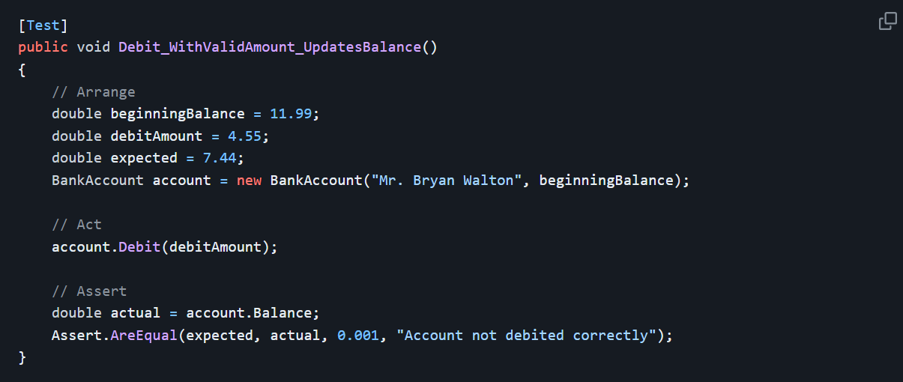
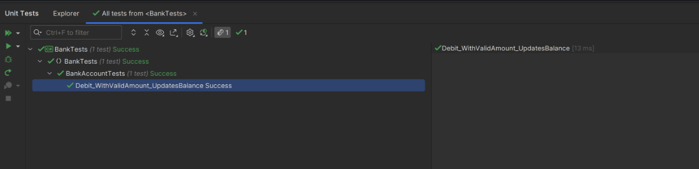
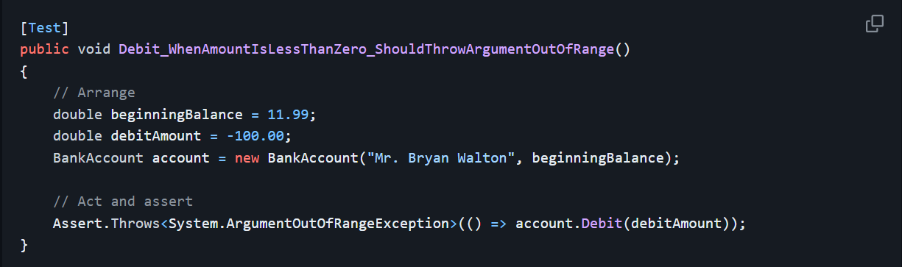
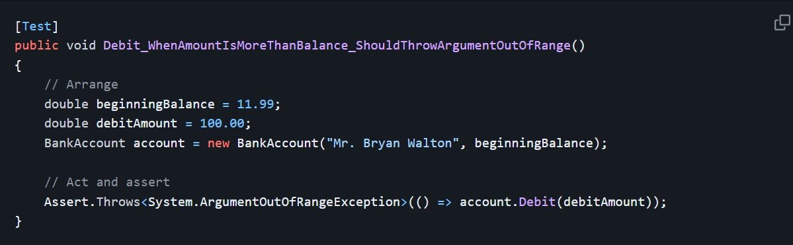
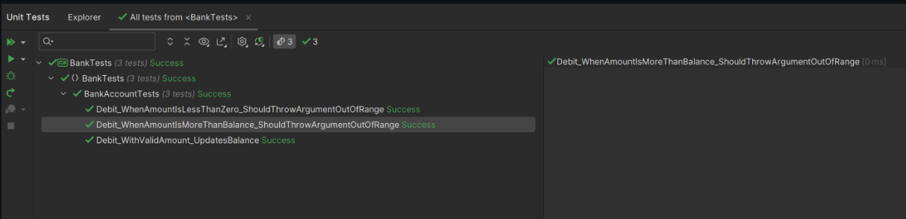

# ponderada-M9S3
Repositório referente à atividade ponderada da semana 3 do módulo 9 - Criando e executando testes para código gerenciado

# Ambinete de desenvolvimento e testagem

* Visual Studio 

# Linguagem utilizada

* C#, utilizando o framework .net (dotnet)

# Assuntos explorados

* Nesta atividade, adquiri conhecimentos práticos sobre a implementação de testes de unidade em C# utilizando o Visual Studio. Os testes unitários desempenham um papel crucial no desenvolvimento de software, proporcionando uma abordagem sistemática para verificar a precisão e a funcionalidade de unidades individuais de código. Ao identificar e corrigir erros em estágios iniciais do desenvolvimento, os testes unitários contribuem significativamente para a melhoria da qualidade do código. Além disso, oferecem a segurança necessária para realizar alterações no código existente, assegurando que modificações não introduzam falhas inadvertidas. Ao fornecer uma validação contínua do comportamento esperado das unidades de código, os testes unitários promovem a estabilidade e confiabilidade do sistema como um todo, resultando em uma base sólida para a construção e evolução do software. 

# Aprendizado adiquirido

* Criação de testes utilizando classes
* Lógica e estruturação básica de testes unitários
* Manutenção em códigos de teste
* Avaliação qualitativa dos resultados dos testes unitários

# Imagens para ilustração

## Primeiro código a ser testado

## Falha ao executar o código

## Resultado após manutenção do código

## Novo código de teste

## Resultado do teste

